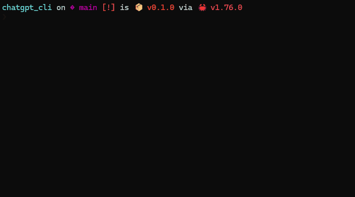

# ChatGPT ストリーミングCLI



下記URL辺りを参考にぬるぬる出力が出るChatGPT CLIをお試しで作ってみました。

- https://platform.openai.com/docs/quickstart
- https://zenn.dev/sekapi/articles/a089c203adad74
- https://zenn.dev/fraim/articles/2024-02-01-rust-hyper-buffer-size

## 実行

```bash
export CHATGPT_APIKEY="ここにAPIキーを書いてください。詳しくは: https://platform.openai.com/account/api-keys"
cargo run -q --bin stream
```